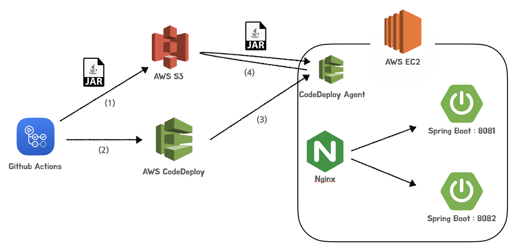

## Study-Deploy
- 목표 : `GitHub Action` + `CodeDeploy` + `Nginx`를 이용한 무중단 배포
- 참고 링크 : https://wbluke.tistory.com/39

---

## 무중단 배포 흐름도

### GitHub Action
1. GitHub Action에서 프로젝트 빌드
2. AWS S3에 jar파일 업로드
3. `AWS CodeDeploy`에 AWS S3에 업로드된 jar파일을 배포해달라고 요청

### AWS CodeDeploy
- EC2 인스턴스 내부에 있는 `CodeDeploy Agent`에 배포 명령 전달

### AWS CodeDeploy Agent
- 다음을 수행하는 배포 스크립트 준비 필요
  - 새로운 Spring Boot WAS 띄우기
  - Nginx 스위칭을 통한 무중단 배포
- S3의 `.jar`파일을 받아서, 주어진 스크립트에 따라 배포 진행

---
